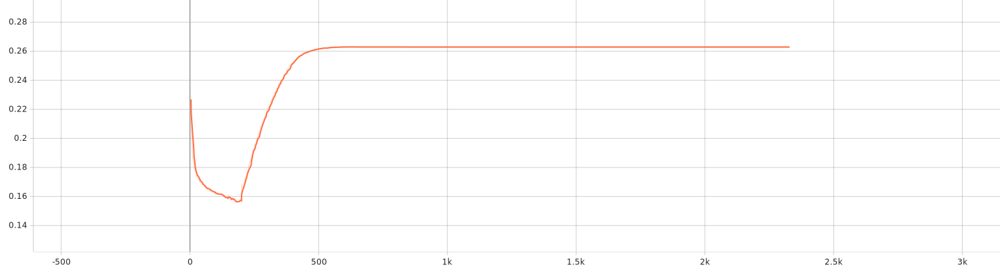

## 訓練版本 1

> KLD loss weight 漸升版。

## Loss

KLD loss 權重在 200 epoch 前為 0，200 epochs 後權重為：

#### KLD Loss

#### Reconstruction Loss

#### Total Loss

## Epoch 180

## Epoch 220

)

放大來看

## Epoch 240

## Epoch 500

## Epoch 1000

## Epoch 2200

## 訓練版本 2

> Cyclically 更新 KLD loss weight，並且手動調整最大 weight。

### Epoch 100

↑ Testing

↑ 兩維度 -1~1 產生 41×41 張圖片

↑ 所有資料化成 Latent Code

### Epoch 2300

#### Testing

#### Loss

↑ KLD Loss

↑ KLD Loss Weight

↑ Reconstruction Loss

↑ Total Loss

#### 兩維度 -1~1 產生 41×41 張圖片

#### 所有資料化成 Latent Code

↑ 點點尺寸縮小並過濾至只有 -300~300